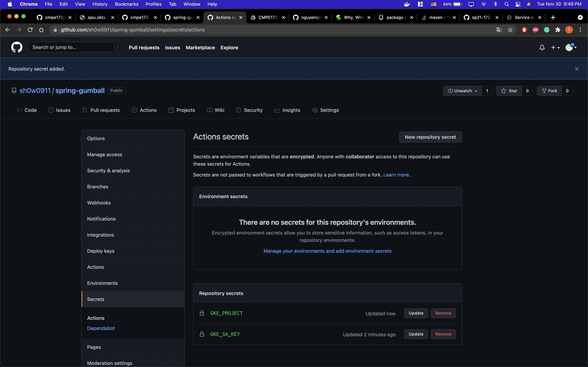
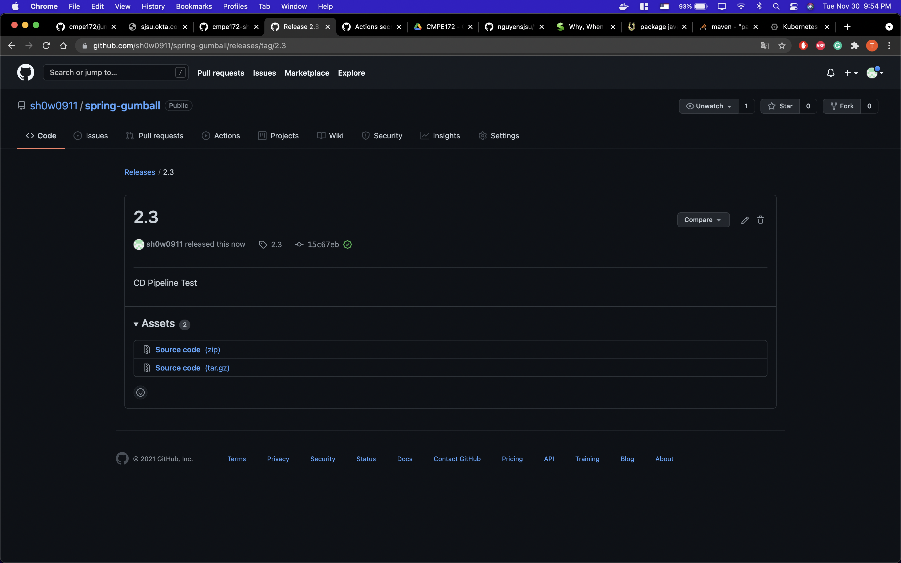

# spring-gumball

1. CI Workflow  
  
  

2. CD Workflow  
   
   
 
 2.1 GCP Service Account & Service Key  
    
    
  
 2.2 GitHub Action Secrets 
    
  
 2.3 GKE Cluster 
    
  
 2.4 GitHub Release
    
    
 
 2.5 GitHub Workflows & build 
    
    
  
 2.6 Build Error 
    
    
    
  
 3. Discussion 
  Even tough I put the correct value on GKE_PORJECT and GKE_SA_KEY, the build was failed. I guess the reason of failure is the version of gcloud. 
